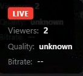
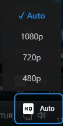
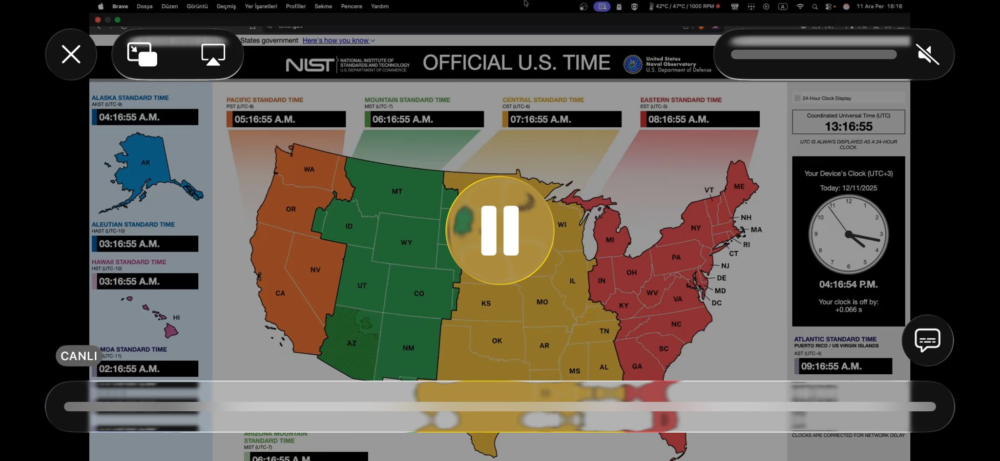

# LANCast

A lightweight, self-hosted LAN video streaming platform for watch parties. Stream from OBS Studio to multiple viewers on your local network with zero external dependencies.

## Screenshots

<!-- Add your screenshots below -->

### Stream Status

<!-- Replace with your screenshot -->

### Quality Selector

<!-- Replace with your screenshot -->

### Mobile View

<!-- Replace with your screenshot -->

---

## Features

- **Single-streamer broadcasting** - One OBS source, multiple viewers
- **Multi-quality HLS** - 1080p, 720p, 480p automatic transcoding
- **Real-time status** - Live viewer count and stream info via WebSocket
- **Zero external dependencies** - Works completely offline on your LAN
- **Mobile-friendly** - Responsive design with touch-friendly controls
- **Hardware acceleration** - Auto-detects NVENC, VideoToolbox, VAAPI
- **Graceful handling** - Proper error recovery and resource cleanup

## How It Works

```
┌─────────────┐      RTMP       ┌─────────────────────────────────────┐
│             │    (port 1935)  │            LANCast Server           │
│  OBS Studio ├────────────────►│                                     │
│             │                 │  ┌─────────┐    ┌───────────────┐   │
└─────────────┘                 │  │  RTMP   │───►│   FFmpeg      │   │
                                │  │ Server  │    │  Transcoder   │   │
                                │  └─────────┘    └───────┬───────┘   │
                                │                         │           │
                                │                    HLS Files        │
                                │                   (.m3u8 + .ts)     │
                                │                         │           │
                                │  ┌─────────┐    ┌───────▼───────┐   │
                                │  │WebSocket│◄───┤  HTTP Server  │   │
                                │  │ Server  │    │  (port 8080)  │   │
                                │  └────┬────┘    └───────┬───────┘   │
                                └───────┼─────────────────┼───────────┘
                                        │                 │
                    Real-time Status    │                 │  HLS Stream
                                        ▼                 ▼
                                ┌─────────────────────────────────────┐
                                │           Browser Viewers           │
                                │  ┌─────────┐  ┌─────────┐  ┌─────┐  │
                                │  │ Viewer 1│  │ Viewer 2│  │ ... │  │
                                │  └─────────┘  └─────────┘  └─────┘  │
                                └─────────────────────────────────────┘
```

## Tech Stack

| Component | Technology |
|-----------|------------|
| Runtime | Node.js 18+ |
| RTMP Server | node-media-server |
| HTTP Server | Express.js |
| WebSocket | ws |
| Transcoding | FFmpeg |
| Client Player | HLS.js |

## Prerequisites

- **Node.js 18+** (LTS recommended)
- **FFmpeg 4.0+** with libx264
- **OBS Studio** (or any RTMP-compatible software)

### Install FFmpeg

```bash
# macOS
brew install ffmpeg

# Ubuntu/Debian
sudo apt install ffmpeg

# Windows (via chocolatey)
choco install ffmpeg

# Windows (manual)
# Download from https://ffmpeg.org/download.html
# Add to PATH
```

Verify installation:
```bash
ffmpeg -version
```

## Quick Start

```bash
# Clone the repository
git clone https://github.com/sadopc/lan-movie.git
cd lan-movie

# Install dependencies
npm install

# Start the server
npm start
```

You should see:
```
LANCast server started
RTMP server listening on port 1935
HTTP server listening on port 8080
Stream URL: http://<your-ip>:8080
```

## OBS Configuration

### 1. Stream Settings

Open **Settings** > **Stream**:

| Setting | Value |
|---------|-------|
| Service | Custom |
| Server | `rtmp://YOUR_SERVER_IP:1935/live` |
| Stream Key | `stream` |

### 2. Output Settings

Open **Settings** > **Output** > **Streaming**:

| Setting | Recommended Value |
|---------|-------------------|
| Encoder | x264 (or NVENC/QuickSync) |
| Rate Control | CBR |
| Bitrate | 5000-8000 kbps |
| Keyframe Interval | 1 second |
| Preset | veryfast |
| Profile | high |

### 3. Start Streaming

Click **Start Streaming** in OBS. The LANCast server will automatically begin transcoding.

## Viewing the Stream

Open any browser on your local network:

```
http://YOUR_SERVER_IP:8080
```

### Player Controls

| Control | Action |
|---------|--------|
| Space | Play/Pause |
| M | Mute/Unmute |
| F | Fullscreen |
| ← → | Seek ±10s |
| ↑ ↓ | Volume ±10% |

## Configuration

### Config File

Edit `src/config.json`:

```json
{
  "server": {
    "rtmpPort": 1935,
    "httpPort": 8080
  },
  "limits": {
    "maxViewers": 10
  },
  "transcoding": {
    "segmentDuration": 2,
    "playlistSize": 5,
    "qualities": ["1080p", "720p", "480p"]
  }
}
```

### Environment Variables

Override any setting via environment variables:

| Variable | Default | Description |
|----------|---------|-------------|
| `RTMP_PORT` | 1935 | RTMP ingest port |
| `HTTP_PORT` | 8080 | HTTP/WebSocket port |
| `MAX_VIEWERS` | 10 | Maximum concurrent viewers |
| `SEGMENT_DURATION` | 2 | HLS segment length (seconds) |
| `PLAYLIST_SIZE` | 5 | Number of segments in playlist |

Example:
```bash
MAX_VIEWERS=50 HTTP_PORT=3000 npm start
```

## Quality Presets

| Quality | Resolution | Video Bitrate | Audio |
|---------|------------|---------------|-------|
| 1080p | 1920x1080 | 5000 kbps | 192 kbps AAC |
| 720p | 1280x720 | 2500 kbps | 128 kbps AAC |
| 480p | 854x480 | 1000 kbps | 96 kbps AAC |

## Project Structure

```
movie/
├── src/
│   ├── server/
│   │   ├── index.js        # Entry point, orchestration
│   │   ├── config.js       # Configuration management
│   │   ├── state.js        # Application state (AppState)
│   │   ├── http.js         # Express HTTP server
│   │   ├── rtmp.js         # RTMP ingest server
│   │   ├── websocket.js    # Real-time WebSocket server
│   │   └── transcoder.js   # FFmpeg HLS transcoding
│   ├── public/
│   │   ├── index.html      # Player page
│   │   ├── player.js       # HLS.js integration
│   │   ├── controls.js     # Player controls
│   │   ├── status.js       # WebSocket status client
│   │   └── styles.css      # UI styles
│   └── config.json         # Default configuration
├── tests/
│   ├── unit/               # Unit tests
│   ├── integration/        # Integration tests
│   └── helpers/            # Test utilities
├── media/                  # HLS output (gitignored)
├── specs/                  # Feature specifications
└── package.json
```

## Development

### Running Tests

```bash
# Run all tests
npm test

# Run with coverage
npm run test:coverage

# Run specific test file
npm test -- tests/unit/state.test.js
```

### Test Coverage

The project has 93 passing tests covering:
- Configuration loading and validation
- Application state management
- Stream lifecycle (start/stop)
- Viewer management and limits
- WebSocket connections
- HTTP endpoints
- FFmpeg transcoder integration

## API Reference

### HTTP Endpoints

| Endpoint | Method | Description |
|----------|--------|-------------|
| `/` | GET | Player page |
| `/api/status` | GET | Stream status JSON |
| `/hls/*` | GET | HLS segments and playlists |

### WebSocket Messages

Connect to `ws://YOUR_IP:8080`

**Server → Client:**
```json
{
  "type": "status",
  "data": {
    "stream": { "status": "live", "startedAt": "..." },
    "viewers": { "count": 5, "max": 10 }
  }
}
```

**Connection Rejected (room full):**
```json
{
  "type": "rejected",
  "reason": "room_full"
}
```

## Troubleshooting

### OBS can't connect
- Verify LANCast server is running
- Check firewall allows port 1935 (TCP)
- Confirm server IP address is correct
- Try `telnet YOUR_IP 1935` to test connectivity

### Video not playing
- Wait 3-5 seconds after OBS starts streaming
- Check browser console for errors
- Verify `media/live/` contains `.m3u8` files
- Try a hard refresh (Ctrl+Shift+R)

### "Room full" error
- Default limit is 10 viewers
- Close other browser tabs
- Increase `MAX_VIEWERS` in config

### High latency
- Reduce `SEGMENT_DURATION` to 1
- Use CBR encoding in OBS
- Set keyframe interval to 1 second
- Check network bandwidth

### FFmpeg errors
- Verify FFmpeg is installed: `ffmpeg -version`
- Check FFmpeg supports libx264: `ffmpeg -encoders | grep libx264`
- Review server logs for specific errors

## Performance

| Metric | Value |
|--------|-------|
| Typical latency | 4-8 seconds |
| Max viewers (default) | 10 |
| Max viewers (tested) | 100 |
| Memory usage | ~50-100 MB |
| CPU (transcoding) | Varies by encoder |

Hardware encoding (NVENC, VideoToolbox, VAAPI) significantly reduces CPU usage.

## Limitations

- **LAN only** - Not designed for internet streaming
- **Single stream** - One broadcaster at a time
- **No recording** - Live streaming only
- **No authentication** - Open access on your network

## License

MIT
